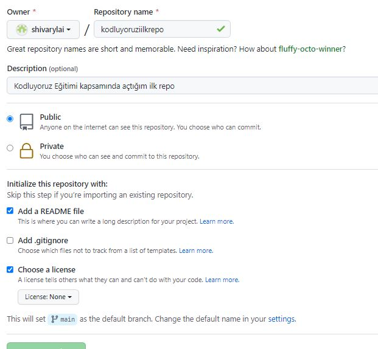

# kodluyoruzilkrepo
Kodluyoruz Eğitimi kapsamında açtığım ilk repo


# Installation
Öncellikle projeyi clonelayın.(https://github.com/shivarylai/kodluyoruzilkrepo.git)
```bash
git clone https://github.com/shivarylai/kodluyoruzilkrepo.git
```

# Usage 
Projeyi cloneladıktan sonra Visual Studio Code programında açınız.

Linux için:
```bash
cd ilkrepo
code .
```
# Contributing
Pull requestler kabul edilir. Büyük değişiklikler için, lütfen önce neyi değiştirmek istediğinizi tartışmak için bir konu açınız.

# Licence
[MIT](https://choosealicense.com/licenses/mit/)
